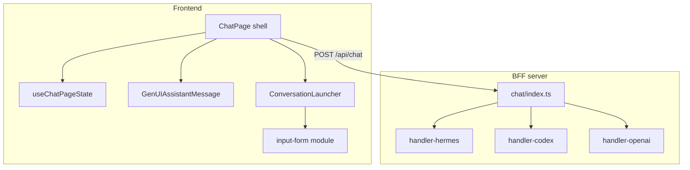

# Plano de split profundo — `server/chat.ts` e `ChatPage.tsx`

Handoff para agente executor. Estado em **2026-07-09**.

## Contexto

O `waves_client` passou pelas Fases 1–3 (hardening) e pela Fase 4 parcial (seams leves + módulo `input_form`). Os **dois monolitos principais ainda não foram desmembrados**.

| Arquivo | Linhas | Problema |
|---|---:|---|
| `server/chat.ts` | ~2265 | Orquestrador + 3 providers (OpenAI / Codex / Hermes) + anexos + escopo + SSE + tools num único arquivo |
| `src/components/ChatPage.tsx` | ~1632 | Shell da página + GenUI renderer + bridges + workflow shortcuts + estado global |

**Objetivo:** arquivos finos (~150–300 linhas) que **orquestram**; lógica em módulos coesos, testáveis por fatia incremental.

### Já extraído (não refazer)

| Item | Local |
|---|---|
| `input_form` | `src/modules/input-form/` |
| Gate do form em balão | `src/components/ConversationLauncher.tsx` |
| Hardcodes → config | `server/runtime-config.ts` |
| Proxy Waves | `server/upstream-registry.ts` |
| xlsx isolado | `server/sheet-extract.ts` |
| Rotas admin (seam Integration Manager) | `src/modules/app-routes.tsx` |
| Allowlist de URLs | `src/lib/open-url-allowlist.ts` |

### Estado git

- **Último commit pushed:** `d9104fe` (Fase 3)
- **Fase 4:** mudanças locais (input_form, seams, faxina) — **uncommitted**
- **`server/chat/`:** ainda **não existe**

---

## Split 1 — `server/chat.ts` → `server/chat/`

### API pública (preservar)

Consumidores atuais:

```ts
// server/index.ts
import { handleChatRequest, resolveHermesGateway } from "./chat.js";

// server/analyze.ts
import { resolveHermesGateway } from "./chat.js";
```

**Exports obrigatórios:** `handleChatRequest`, `resolveHermesGateway`.

**Compatibilidade:** manter `server/chat.ts` como re-export fino:

```ts
export { handleChatRequest, resolveHermesGateway } from "./chat/index.js";
```

Alternativa: atualizar imports em `index.ts` e `analyze.ts` e remover `chat.ts`.

### Árvore alvo

```
server/chat/
  index.ts              # orquestrador (~120 linhas)
  types.ts              # ChatRequestBody, payloads compartilhados
  hermes-gateway.ts     # anti-SSRF + resolveHermesGateway
  attachments.ts        # sanitize, inject, imageToDataUri, ownerFromSignedUrl
  scope-context.ts      # buildScopeContext + interfaces UserScope*
  tools-waves.ts        # createTools, createCodexToolsAndExecutors
  sse-helpers.ts        # sseToolCall*, streamHardcodedOpenUI, findLastUserMessage
  message-utils.ts      # truncateOldAssistantUI, OPENUI_HINT_RE
  handler-openai.ts     # branch OpenAI clássico (runTools)
  handler-codex.ts      # handleChatRequestCodex
  handler-hermes.ts     # handleChatRequestHermes (~650 linhas — maior risco)
```

### Mapa linha → módulo (referência em `server/chat.ts`)

| Faixa (aprox.) | Símbolos | Destino |
|---|---|---|
| 57–156 | `HERMES_ALLOWED_*`, `isAllowedHermesPort`, `resolveHermesGateway` | `hermes-gateway.ts` |
| 157–466 | `createTools`, `createCodexToolsAndExecutors` | `tools-waves.ts` |
| 467–538 | `sseToolCallStart`, `sseToolCallArgs` | `sse-helpers.ts` |
| 539–636 | `UserScope*`, interfaces de escopo | `types.ts` / `scope-context.ts` |
| 637–849 | `AttachmentPayload`, `sanitizeAttachments`, `injectAttachments` | `attachments.ts` |
| 850–1003 | `buildScopeContext` | `scope-context.ts` |
| 1004–1123 | Pré-processamento do orquestrador | `index.ts` |
| 1125–1294 | Branch OpenAI `runTools` + heartbeat SSE | `handler-openai.ts` |
| 1301–1532 | `handleChatRequestCodex` | `handler-codex.ts` |
| 1533–2184 | `truncateOldAssistantUI`, `handleChatRequestHermes` | `message-utils.ts` + `handler-hermes.ts` |
| 2185–2265 | `findLastUserMessage`, `streamHardcodedOpenUI` | `sse-helpers.ts` |

### Fluxo de `handleChatRequest` (ordem não pode mudar)

```
1. sanitizeAttachments → injectAttachments
2. buildScopeContext(body)
3. findLastUserMessage
   → getDemoReport?        → streamHardcodedOpenUI (early return)
4. isCacheableTrigger?
   → getFormCached?        → streamHardcodedOpenUI (early return)
   → senão marca body.__cacheTrigger
5. Valida wavesSession (401 se ausente)
6. getOpenAiProvider() → resolve apiKey (exceto hermes)
7. Dispatch:
   - codex  → handleChatRequestCodex
   - hermes → resolveHermesGateway(host, port) → handleChatRequestHermes
   - else   → handleChatRequestOpenAI
```

### Dependências externas (importar, não mover)

| Módulo | Uso |
|---|---|
| `server/tool-progress.ts` | `setProgress` / `clearProgress` por `sessionId` (Hermes) |
| `server/specialist-jobs.ts` | `backendForPort`, rendered API, job cards |
| `server/form-cache.ts` | triggers `__form_cnpj__` / `__form_cpf__` |
| `server/demo-reports.ts` | `getDemoReport` |
| `server/codex-client.ts` | handler Codex |
| `server/tenant.ts` | `getActiveTenant()` em anexos |
| `server/waves-session.ts`, `server/openai-config.ts` | credenciais / provider |

### Pontos de risco — `handler-hermes.ts`

1. **Stream SSE** com heartbeat 1s, tool-call events, reasoning chunks
2. **Tools `consult_*`** — detecta job_id no `.db` e injeta card `check_job`
3. **`RENDER_SYNTAX_REMINDER`** — mensagem `system` imediatamente antes da última mensagem `user`
4. **`truncateOldAssistantUI`** — economia de tokens em histórico longo
5. **`cacheTrigger`** — ao fim do stream, grava resposta em `form-cache`
6. Headers: `X-Hermes-Reasoning-Effort`, `X-Hermes-Agent-Id`, sessionId com `threadId`

### Ordem de execução sugerida

1. `types.ts` + `hermes-gateway.ts` (move puro)
2. `attachments.ts` + `scope-context.ts`
3. `sse-helpers.ts` + `message-utils.ts`
4. `tools-waves.ts`
5. `handler-codex.ts`
6. `handler-openai.ts` (branch inline hoje em `handleChatRequest`, ~170 linhas)
7. `handler-hermes.ts` (último — maior blast radius)
8. `index.ts` orquestrador + re-export em `server/chat.ts`
9. `npm run build`

### Validação por fatia

```bash
cd /home/bot/waves_client && npm run build
sudo -u bot systemctl --user restart waves-client   # deploy local
```

| Cenário | O que prova |
|---|---|
| Mensagem normal (profile Hermes) | Stream SSE, resposta openui-lang |
| Anexo PDF/imagem | `sanitizeAttachments` + inject |
| Trigger demo (`__demo_cnpj__`, etc.) | demo hardcoded |
| Tool `consult_*` / job card | specialist-jobs + tool-progress |
| Admin + `wantUsage` | tokens no stream |
| `server/analyze.ts` | `resolveHermesGateway` continua funcionando |

### Critérios de done — Split 1

- [ ] `server/chat.ts` ≤ 20 linhas (re-export) ou removido com imports atualizados
- [ ] Nenhum arquivo em `server/chat/` > ~700 linhas
- [ ] `npm run build` verde
- [ ] Smoke Hermes + anexo + demo trigger

---

## Split 2 — `ChatPage.tsx` → `src/components/chat/`

### API pública (preservar)

```tsx
// src/App.tsx
import { ChatPage } from "./components/ChatPage";

export function ChatPage({ session, onLogout }: ChatPageProps)
```

**Não mudar props** de `ChatPage`.

### Árvore alvo

```
src/components/chat/
  GenUIAssistantMessage.tsx    # renderer openui-lang + actions (~380 linhas)
  AssistantMessageShell.tsx    # shell + MessageMeta + export
  WelcomeArea.tsx              # starters + welcome (usa input-form gate)
  CreateTaskTrigger.tsx        # diretiva open_create_task
  ChatBridges.tsx              # FileUploadBridge, ThreadSelector, RunTracker, etc.
  ThreadRestorer.tsx           # hidratação histórico + keyboard shortcuts
  WorkflowShortcuts.tsx        # kanban/gantt determinísticos + tryWorkflowViewShortcut
  starter-utils.ts             # pickIcon, platformStartersFor, parsers de report
  useChatPageState.ts          # profiles, threads, processMessage, modals, branding
src/components/ChatPage.tsx    # shell fino (~200–300 linhas)
```

### Mapa linha → módulo (referência em `ChatPage.tsx`)

| Faixa (aprox.) | Símbolos | Destino |
|---|---|---|
| 106–150 | `pickIcon`, `mapPlatformStarter`, `platformStartersFor` | `starter-utils.ts` |
| 175–250 | `stripNullArgs`, `parseAnalysisReport`, `execReportToOpenui` | `starter-utils.ts` |
| 252–337 | `parseCreateTaskDirective`, `CreateTaskTrigger` | `CreateTaskTrigger.tsx` |
| 338–384 | `AssistantMessageShell`, `MessageMeta` | `AssistantMessageShell.tsx` |
| 387–547 | `GenUIAssistantMessage` | `GenUIAssistantMessage.tsx` |
| 549–607 | `WelcomeArea` | `WelcomeArea.tsx` |
| 608–755 | `FileUploadBridge`, `ThreadSelector`, `RunTracker`, `BackgroundJobWatcher`, `ScrollAnchorOnOpen`, `BackgroundRunWatcher`, `ChatAppendListener` | `ChatBridges.tsx` |
| 757–927 | `escOL`, `fmtBR`, `buildTaskCard`, kanban/gantt builders, `syntheticSse`, `tryWorkflowViewShortcut` | `WorkflowShortcuts.tsx` |
| 928–987 | `ThreadRestorer` | `ThreadRestorer.tsx` |
| 988–1632 | `ChatPage` + hooks / estado / `processMessage` | `useChatPageState.ts` + shell |

### Já fora do ChatPage (não mover de novo)

- `ConversationLauncher.tsx` — gate do `input_form` em balão
- `ChatComposer`, `UserMessageView`, `SidebarThreadHistory`
- `src/modules/input-form/*`

### Dependências críticas

| Concern | Detalhe |
|---|---|
| `ChatProvider` / `useThread` | Bridges devem renderizar **dentro** do provider |
| `processMessage` custom | Monta body `/api/chat` (host, port, reasoning, attachments, userScope) |
| `ActiveThreadContext` | thread ativa por profile/tenant |
| `pending-chat-request`, `shortcut-history`, `active-runs` | recovery e atalhos |
| `installAuthInterceptor` | mount único no ChatPage |
| `ensureToolProvider` | OpenUI runtime EXECUTE |

### Contrato de `processMessage` (preservar ordem)

Antes de chamar `/api/chat`:

1. Upload de anexos (se houver)
2. `tryWorkflowViewShortcut(text)` → resposta sintética SSE (kanban/gantt) sem LLM
3. Starters / shortcuts de histórico
4. Montagem do payload: `profile`, `port`, `host`, `threadId`, `reasoningEffort`, `attachments`, `userScope`

O BFF (`handleChatRequest`) depende desse formato — **não alterar ordem nem campos**.

### Ordem de execução sugerida

1. `starter-utils.ts` + `WorkflowShortcuts.tsx` (sem JSX de página)
2. Leaf components: `CreateTaskTrigger`, `AssistantMessageShell`, `WelcomeArea`
3. `GenUIAssistantMessage` (testar actions: `edit_task`, `create_task`, `continue_conversation`, `open_url`)
4. `ChatBridges.tsx` + `ThreadRestorer.tsx`
5. `useChatPageState.ts` (estado + effects + `processMessage`)
6. `ChatPage.tsx` shell fino
7. `npm run build`

### Validação por fatia

| Cenário | O que prova |
|---|---|
| Nova conversa + starter click | WelcomeArea + processMessage |
| Troca de profile/agent | localStorage / sessionStorage thread keys |
| Anexo via drag/drop | FileUploadBridge |
| Atalho kanban/gantt | WorkflowShortcuts + syntheticSse |
| Job card em background | BackgroundJobWatcher |
| Form gate (`localStorage['wif-mock']='1'`) | ConversationLauncher + composer oculto |
| Export de mensagem | MessageExport no shell |
| Admin tokens badge | `setAdminFlag` + wantUsage |
| Recuperação 401/rede | ThreadErrorRecovery (fora do split, integração) |

### Critérios de done — Split 2

- [ ] `ChatPage.tsx` ≤ ~300 linhas
- [ ] Nenhum subcomponente > ~400 linhas
- [ ] `npm run build` verde
- [ ] Smoke: chat, form mock, workflow shortcut, troca profile

---

## Diagrama de dependências



---

## Regras do ambiente

| Regra | Detalhe |
|---|---|
| Repo | `/home/bot/waves_client` |
| Deploy | user `bot`, serviço `waves-client.service` |
| Multi-tenant | Host + `.secrets/tenants.json` |
| Commit/push | **Só quando o usuário pedir**; push como `sudo -u bot -H git push` |
| Playbook | `/root/.claude/skills/hermes-waves-playbook/SKILL.md` |
| Domínio de teste | `client.devellwaves.com.br` |

---

## Prioridade sugerida

1. **Split 1** (`server/chat.ts`) — impacto backend isolado, menos regressão visual
2. **Split 2** (`ChatPage.tsx`) — depende menos do split 1, mas convém depois
3. Commit Fase 4 **somente se usuário pedir**
4. Remover mock QA (`sample.acady.ts`, flag `wif-mock`) quando waves-core entregar `input_form`
5. Trocar `xlsx@0.18.5` (já isolado em `sheet-extract.ts`) — fora do escopo deste split

---

## Referências

- `docs/REQUEST_LIFECYCLE.md` — ciclo de vida de requests + §12 input_form
- `docs/DEPLOY-FASE1-HARDENING.md` — padrão de doc de deploy por fase
- Arquitetura-alvo (5 projetos): waves-core, webapp (este repo), integration-core, agent-gateway, platform-infra
